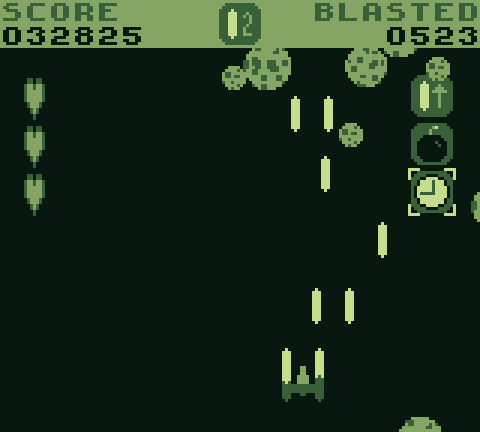
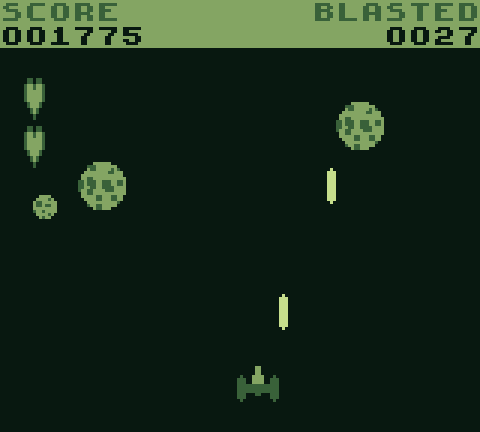
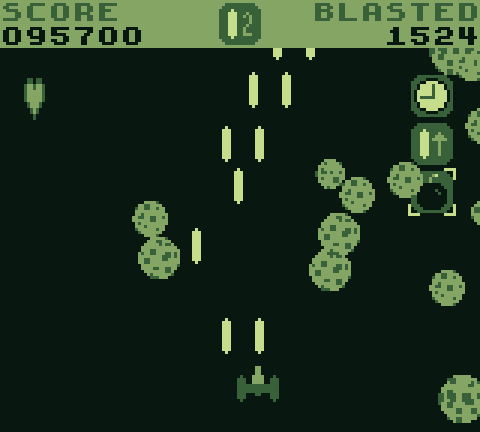
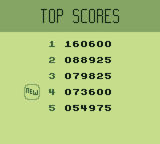
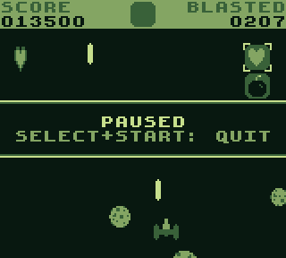

# Cookie Shooter GB
A Game Boy arcade shooter game!

Based on Cookie Shooter, one of the first games I've made.

## Building
Requirements:
- [RGBDS](https://github.com/gbdev/rgbds) v0.5.0 or later
- [SuperFamiconv](https://github.com/Optiroc/SuperFamiconv) `f4b4254` or later
- GNU Make

Run `make` in the root directory of the repository to produce `bin/cookie-shooter.gb`, along with its map and symbol files.

## Attribution
### GBSoundSystem
This game uses a slightly modified version of [GBSoundSystem](https://github.com/BlitterObjectBob/GBSoundSystem) to play its music and sound effects.

GBSoundSystem and the modifications made to it as part of this project are licensed under the MIT License, which can be found in [LICENSE](LICENSE).

# The Game

## How to Play
You're a spaceship flying through space with cookies coming at you!

Use the left and right buttons on the D-Pad to move.
Press the A button to shoot a laser and get points for blasting a cookie.
Try not to get hit by the cookies, though; once you run out of lives, it's game over!

The smaller the cookie, the more points you get for hitting it &mdash; 25, 50, 75, 100, or 125 points.

As your score climbs, the game gets harder: more and more cookies will be on screen at once!

## Actions
The action selection screen will appear after the title screen.
You can choose whether you want to play a game ("Play") or just to view your top scores ("Top Scores").

You will see the game mode selection screen after selecting one of the actions.

## Game Modes
There are 2 game modes: Classic and Super.

The game mode selection screen will appear after the action selection screen.
From there, you can select the game mode you want to play or view top scores for.

### Classic Mode
The original Cookie Shooter, plain and simple.

You shoot, hit cookies, and get points.
You get hit, you lose a life.
Lose all 3 lives, and the game is over.

### Super Mode
A fancy new way to play with power-ups!

All the fun of Classic Cookie Shooter, plus 5 power-ups, usable with the B button.

You can hold a maximum of 3 power-ups at a time, and out of those 3, you can select one to use with the up/down buttons.
When used, they override any currently in-use power-up, except for a couple of them which are "immediate": the Bomb and Extra Life immediately change things, and leave the current power-up in use.

Power-ups are given to you once your score passes a multiple of their point rates. The following table lists all power-ups in the game with their effects and their point rates.
<table>
  <thead>
    <tr>
      <th>Power-Up</th>
      <th>Point Rate</th>
      <th>Effect</th>
    </tr>
  </thead>
  <tbody>
    <tr>
      <td>Fast Lasers</td>
      <td>4 000 points</td>
      <td>Speeds up all lasers for 15 seconds</td>
    </tr>
    <tr>
      <td>Bomb</td>
      <td>5 000 points</td>
      <td>Clears the screen of all cookies</td>
    </tr>
    <tr>
      <td>Slow Cookies</td>
      <td>7 000 points</td>
      <td>Slows down all cookies to half speed for 15 seconds</td>
    </tr>
    <tr>
      <td>Double Lasers</td>
      <td>9 000 points</td>
      <td>The spaceship will shoot 2 lasers at once for 20 seconds</td>
    </tr>
    <tr>
      <td>Extra Life</td>
      <td>10 000 points</td>
      <td>A life is added to your remaining lives</td>
    </tr>
  </tbody>
</table>

## Game Over!
After losing all of your lives, the game will end. You will be shown the top scores, and if you made it to the top, a little "NEW" sticker will be shown next to your new top score.

## Pause
While in-game, pressing START will pause the game. The "paused" strip will appear on-screen when paused:

From there, the game can be unpaused by pressing START again, or you can quit the game by pressing START with SELECT held down.
Quitting the game will send you back to the mode select screen.

## In-Game Controls
<table>
  <thead>
    <tr>
      <th>Button</th>
      <th>Function</th>
    </tr>
  </thead>
  <tbody>
    <tr>
      <td>Left/Right</td>
      <td>Move spaceship</td>
    </tr>
    <tr>
      <td>A</td>
      <td>Shoot laser</td>
    </tr>
    <tr>
      <td>START</td>
      <td>Pause/Resume game</td>
    </tr>
    <tr>
      <td>SELECT+START</td>
      <td>Quit game (only when paused)</td>
    </tr>
  </tbody>
</table>

### Super Mode-Specific Controls
<table>
  <thead>
    <tr>
      <th>Button</th>
      <th>Function</th>
    </tr>
  </thead>
  <tbody>
    <tr>
      <td>Up/Down</td>
      <td>Change power-up selection</td>
    </tr>
    <tr>
      <td>B</td>
      <td>Use power-up</td>
    </tr>
  </tbody>
</table>
